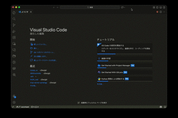

# Claude Code Explorer

A VSCode extension for intuitively managing Claude Code configuration files, slash commands, and sub-agents.

## Features

- 🔍 **Auto Detection** - Automatically scans project and user configuration files
- 📂 **Hierarchical View** - Groups files by namespace and scope
- ✏️ **One-Click Edit** - Click a file to open it in the editor
- ➕ **Easy Creation** - Wizard-style new file creation
- 🔄 **Auto Refresh** - Detects file changes and refreshes automatically

## Capabilities

### 📁 CLAUDE.md File Management

Manage project memory files

- Detect and edit `CLAUDE.md` / `CLAUDE.local.md`
- Support for user global settings (`~/.claude/CLAUDE.md`)
- Visual distinction between project/user scopes

### ⌨️ Slash Command Management

List and create custom commands

- Display command descriptions and argument information
- Group by namespace (e.g., `sc:build`, `sc:test`)
- New command creation wizard

### 🤖 Sub-Agent Management

Manage custom agents

- Display agent name, description, and available tools
- Show project/user scope

### ⚙️ Settings File Management

Manage JSON configuration files

- Detect `settings.json` / `settings.local.json`
- Support for `~/.claude.json` global settings
- JSON validation with warning display

## Usage

### Open Explorer

1. Click the **Claude Code Explorer** icon in the Activity Bar
2. Or `Cmd+Shift+P` → "Claude Code Explorer: Open Settings Explorer"

### Open Files

Click a file in the tree view to open it in the editor.

### Create Slash Command

1. Click the `+` icon in the Slash Commands view title bar
2. Select scope (Project/User)
3. Enter command name
4. (Optional) Enter namespace

### Create CLAUDE.md

`Cmd+Shift+P` → "Claude Code Explorer: Create CLAUDE.md"

## Settings

| Setting | Description | Default |
|---------|-------------|---------|
| `ccexp.showHiddenFiles` | Show hidden files | `false` |
| `ccexp.scanRecursively` | Recursively scan subdirectories | `true` |
| `ccexp.autoRefresh` | Auto refresh on file changes | `true` |

## Supported Files

| Type | Project | User |
|------|---------|------|
| CLAUDE.md | `./CLAUDE.md`, `./CLAUDE.local.md` | `~/.claude/CLAUDE.md` |
| Slash Commands | `.claude/commands/**/*.md` | `~/.claude/commands/**/*.md` |
| Sub-Agents | `.claude/agents/**/*.md` | `~/.claude/agents/**/*.md` |
| Settings | `.claude/settings.json` | `~/.claude/settings.json`, `~/.claude.json` |

## Requirements

- VSCode 1.85.0 or later
- [Claude Code](https://claude.ai/download) installed (recommended)

## Related Links

- [Claude Code Official Documentation](https://docs.anthropic.com/en/docs/claude-code)
- [ccexp (CLI version)](https://github.com/nyatinte/ccexp) - Original CLI tool
- [Report Issues](https://github.com/safeekow/ccexp_vc/issues)

## License

MIT License - See [LICENSE](LICENSE.txt) for details.
